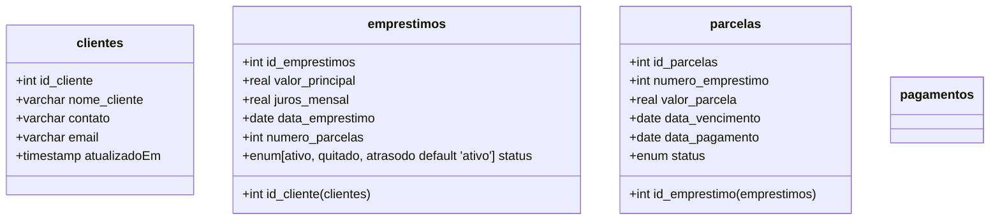

## Estrutura do Banco de Dados

```mermaid
classDiagram
    class clientes{
        +int id_cliente
        +varchar nome_cliente
        +varchar contato
        +varchar email
        +timestamp atualizadoEm
    }

    class emprestimos{
        +int id_emprestimos
        +real valor_principal
        +real juros_mensal
        +date data_emprestimo
        +int numero_parcelas
        +enum[ativo, quitado, atrasodo default 'ativo'] status
        +int id_cliente(clientes)
    }

    class parcelas{
        +int id_parcelas
        +int numero_emprestimo
        +real valor_parcela
        +date data_vencimento
        +date data_pagamento
        +enum status
        +int id_emprestimo(emprestimos)
    }
    class pagamentos{
        
    }

```